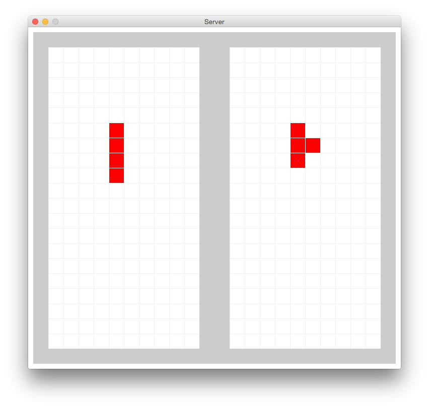

# Processing_UDPClient

##What's this
ProcessingとUDPライブラリを適用して、UDP通信を実装したプログラム。

テトリスゲームが実装されています。
ただし、サーバ機能だけを提供しているので、
実際に対戦するにはAndroidクライアントアプリが必要です。

##Goal
__Android__クライアント作って、__ネットワーク経由で通信する__こと。

[satsukies/Android_UDP]("https://github.com/satsukies/Android_UDP")でゲームコントローラを配布してます。
